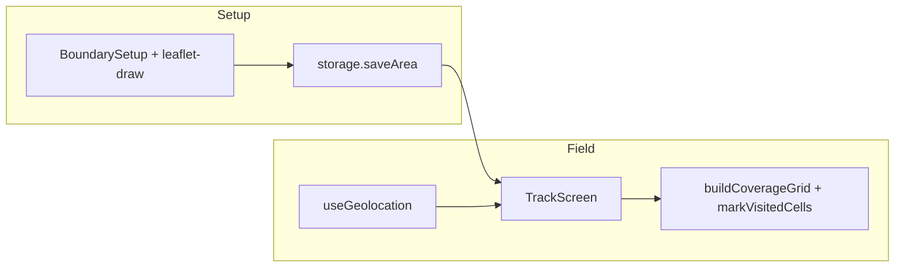

# PROJECT_CONTEXT — Census Area Tracker

> **Resume in a new chat:** Read this file, then continue from **§12 Current status** and **§13 Next tasks**.

---

## 1. Project purpose

Personal **census duty coverage helper**: draw the assigned map boundary, walk the area with GPS on, see traveled path and approximate covered vs uncovered cells.

**Non-goals:** Not official census software; no government API; no cloud sync in v1.

---

## 2. User decisions (frozen)

| Decision | Choice |
| -------- | ------ |
| Language | **JavaScript** (React JSX), not TypeScript |
| Platform | PWA — phone browser + Add to Home Screen |
| Maps | Leaflet + OSM streets + Esri satellite + Esri labels overlay (free, no API key) |
| Boundary | Draw polygon on map; optional GeoJSON import |
| Data | Local only — IndexedDB via `idb` |
| Workspace | `e:\Development\mini proj\census-tracker` |

---

## 3. Architecture overview



**Screens (`App.jsx`):** `areas` | `setup` | `import` | `track` | `history`

**Desktop planner (`planner.html`):** export-only — draw boundary, download `.census-area.json` (no IndexedDB). Uses `useWatchLocation` for blue-dot current position on map.

---

## 4. Tech stack & versions

See `package.json`. Core:

- React 19, Vite 8
- react-leaflet 5, leaflet, leaflet-draw
- @turf/turf 7
- idb 8
- vite-plugin-pwa

---

## 5. Repo map

| File | Role |
| ---- | ---- |
| `src/main.jsx` | React entry |
| `src/App.jsx` | Screen routing, nav, geolocation center on load |
| `src/App.css` | Mobile-first dark UI |
| `src/lib/storage.js` | IndexedDB: `areas`, `sessions` |
| `src/lib/geo.js` | Grid, coverage %, distance, export, GeoJSON parse |
| `src/lib/areaPackage.js` | Export/import `.census-area.json` + GeoJSON fallback |
| `planner.html` / `src/planner/` | Desktop area planner (multi-page build) |
| `src/components/ImportArea.jsx` | Mobile import area file → IndexedDB |
| `src/lib/leafletIcons.js` | Fix Vite marker icon paths |
| `src/hooks/useGeolocation.js` | watchPosition start/pause/stop |
| `src/hooks/useWatchLocation.js` | Continuous GPS for planner blue dot |
| `src/components/UserLocationMarker.jsx` | Blue CircleMarker for current position |
| `src/components/MapPanTo.jsx` | Pan map without zoom change |
| `src/components/MapView.jsx` | MapContainer, streets/satellite tiles, `followMode` pan/none, fitBounds once |
| `src/components/BoundarySetup.jsx` | Place autocomplete (Nominatim), satellite/street toggle, GeoJSON import |
| `src/components/PlaceAutocomplete.jsx` | Debounced place search dropdown, explicit select only |
| `src/lib/geocode.js` | Nominatim search, distance sort nearest-first |
| `src/components/PolygonDrawTool.jsx` | Click-to-add polygon vertices, undo, close (replaces leaflet-draw) |
| `src/components/TrackScreen.jsx` | GPS track, manual mark mode, undo mark, pan-only follow |
| `src/components/CoverageLayer.jsx` | Green/red grid; clickable when `interactive` |
| `src/components/AreaList.jsx` | List/create/delete areas |
| `src/components/SessionHistory.jsx` | Completed sessions, export |
| `src/components/HelpModal.jsx` | 3-step in-app help |
| `vite.config.js` | React + PWA + OSM tile caching |

---

## 6. Data models

### SavedArea

```js
{
  id: string,           // crypto.randomUUID()
  name: string,
  boundary: Polygon,    // GeoJSON Polygon
  createdAt: number,
  gridCellSizeM: number // default 40
}
```

### TrackPoint

```js
{ lat, lng, timestamp, accuracy }
```

### TrackingSession

```js
{
  id, areaId, startedAt, endedAt?,
  points: TrackPoint[],
  visitedCellIds: string[],
  status: 'active' | 'paused' | 'completed'
}
```

### IndexedDB

- DB: `census-tracker` v1
- Stores: `areas` (key `id`), `sessions` (key `id`)

### Area package file (desktop → phone)

```js
{
  format: 'census-tracker-area',
  version: 1,
  name: string,
  gridCellSizeM: number,
  boundary: Polygon,
  exportedAt: number
}
```

Transfer: download on `/planner.html` → send file → **Import area** on mobile.

---

## 7. Algorithms

| Item | Value / logic |
| ---- | ------------- |
| Accuracy filter | Skip points with `accuracy > 30` m |
| Grid | `turf.squareGrid` with `mask: boundary`, cell size from `gridCellSizeM` |
| Cell ID | `"lng_lat"` from cell center, 5 decimals |
| Visited | Point inside cell polygon OR within 15 m of cell center |
| Manual mark | Tap cell in mark mode → add `cell.id` to `visitedCellIds` |
| `findCellAtPoint` | `booleanPointInPolygon` on tap lat/lng |
| Polygon valid | `isValidClosedPolygon` — ring ≥ 4 pts, first ≈ last |
| Polygon build | `buildPolygonFromVertices` / `verticesFromPolygon` in geo.js |
| Inside boundary | `turf.booleanPointInPolygon` |
| Map follow | `followMode: 'pan'` — `panTo` only, never resets zoom |

---

## 8. UI routes / screens

| Screen | Component | Actions |
| ------ | --------- | ------- |
| Areas | `AreaList` | New area, edit, delete, start track |
| Setup | `BoundarySetup` | Place autocomplete (pick suggestion to pan map); draw boundary; import, save |
| Track | `TrackScreen` | Start/Pause/Stop, zoom freely, Mark cells manually + undo |
| History | `SessionHistory` | List completed, export GeoJSON/GPX, delete |

Bottom nav: Areas, History, Help (modal).

---

## 9. Geolocation & PWA notes

- **HTTPS required** on real phones for geolocation (localhost OK for dev).
- **Keep screen on** — background GPS limited, especially iOS.
- Pre-load map tiles on Wi‑Fi before field (service worker caches OSM tiles).
- Disclaimer shown: coverage is approximate.

---

## 10. Commands

```bash
npm install
npm run dev      # mobile: http://localhost:5173 — planner: /planner.html
npm run build    # output: dist/ (index.html + planner.html)
npm run preview  # preview production build
```

---

## 11. Environment & hosting

- No `.env` or secrets in v1.
- Deploy `dist/` to Netlify / Vercel / GitHub Pages (HTTPS).
- Nominatim search uses public API — polite use, needs network.

---

## 12. Current status

- [x] Phase 1 — Map + boundary draw/save/load/delete
- [x] Phase 2 — GPS tracking, polyline, session persist
- [x] Phase 3 — Coverage grid + visited cells + %
- [x] Phase 4 — PWA, UI, export, help modal
- [x] JavaScript migration (removed TypeScript)
- [x] README + PROJECT_CONTEXT
- [x] Map UX — satellite toggle, polygon close hints, zoom fix, manual cell marking
- [x] Map draw bugfixes — stable layer switch, satellite labels, custom polygon draw tool
- [x] Grid cell size setting in area setup (25–80 m presets)
- [x] Desktop planner (`/planner.html`) + area package export
- [x] Mobile **Import area** screen + shared `areaPackage.js` parser
- [ ] Phase 5 — Optional: cloud sync, Capacitor, KML import

---

## 13. Next tasks

1. Test satellite tiles + manual mark mode on real phone (HTTPS).
2. Commit/push deployment config (`vercel.json`, `netlify.toml`, GitHub Pages workflow) if not pushed yet.
3. Consider Capacitor if background GPS with screen off is required.
4. Optional: KML import, Hindi UI, cloud sync.

---

## 14. Known bugs & workarounds

| Issue | Workaround |
| ----- | ---------- |
| GPS drift | Walk street center; reduce cell size |
| iOS background pause | Keep app in foreground |
| Nominatim rate limits | Search sparingly; pan map manually |
| Large areas → many grid cells | May slow map; increase cell size |
| Zoom reset while tracking | Fixed — use pan-only follow, do not use `setView` on GPS ticks |
| Polygon “stops” at 3 points | Fixed — custom draw tool; use Close polygon button (≥3 corners) |
| Map resets on Satellite/Street | Fixed — do not put `mapStyle` in MapView `key`; tiles swap in place |
| Satellite has no labels | Fixed — Esri Boundaries and Places overlay on imagery |
| Wrong place on search | Fixed — autocomplete list, nearest first; map moves only on explicit pick |

---

## 15. Future enhancements (Phase 5+)

- Cloud sync / multi-device
- Capacitor Android app
- KML/shapefile import
- Hindi UI
- Alert when leaving boundary

---

## 16. Prompt snippet for new chat

```
Continue the Census Area Tracker PWA in e:\Development\mini proj\census-tracker.
Stack: JavaScript, React, Vite, Leaflet, Turf, IndexedDB.
Read PROJECT_CONTEXT.md first — especially §12 Current status and §13 Next tasks.
Do not re-scaffold; extend the existing codebase.
```
